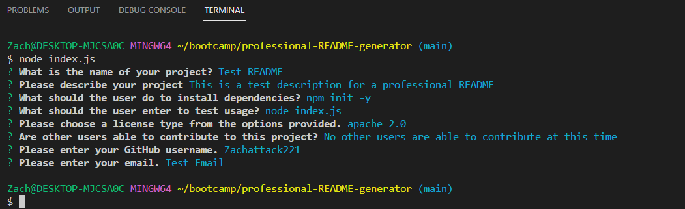
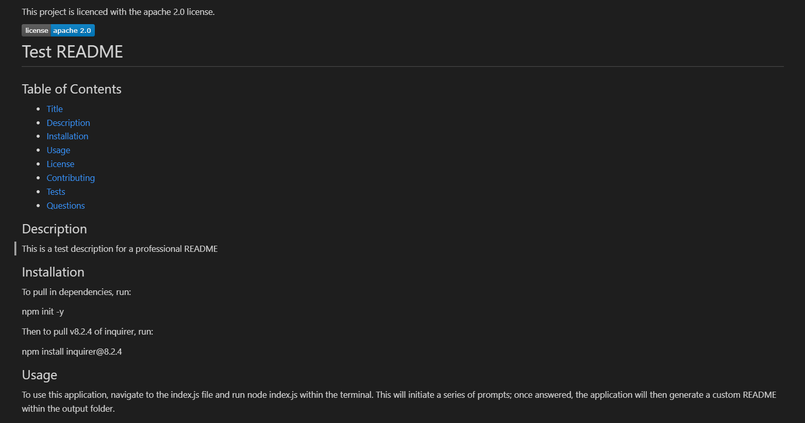
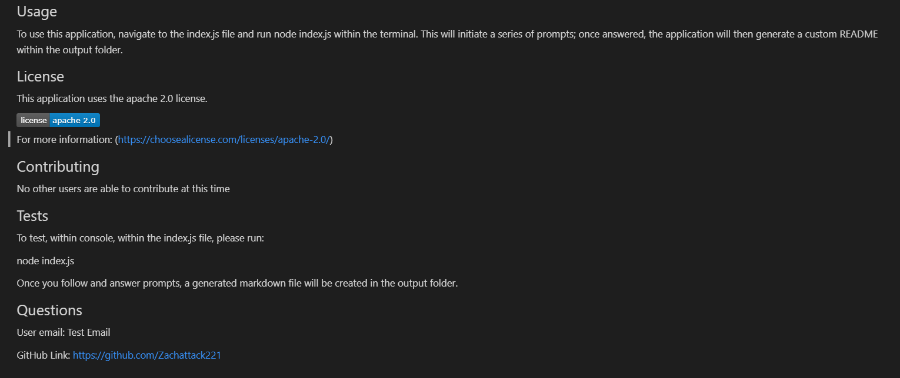

# Professional README Generator 

## Table of Contents
1. [Description](#description)
2. [Visuals](#visuals)

## Description
The goal of this application is to provide the user with a streamlined method of generating a robust README.md file, one that include sections for: Description, Table of Contents, Installation, Usage, License, Contributing, Tests, and Questions. By using the inquirer package, the componets of each section can be dynamically filled via a series of prompts, allowing the user to customize the content of their README.

## Visuals

